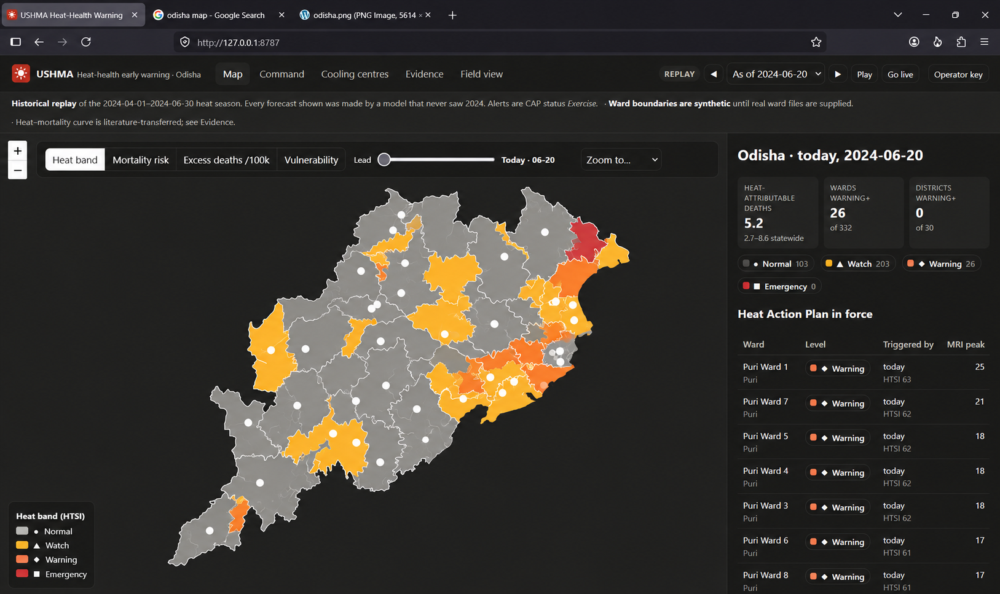
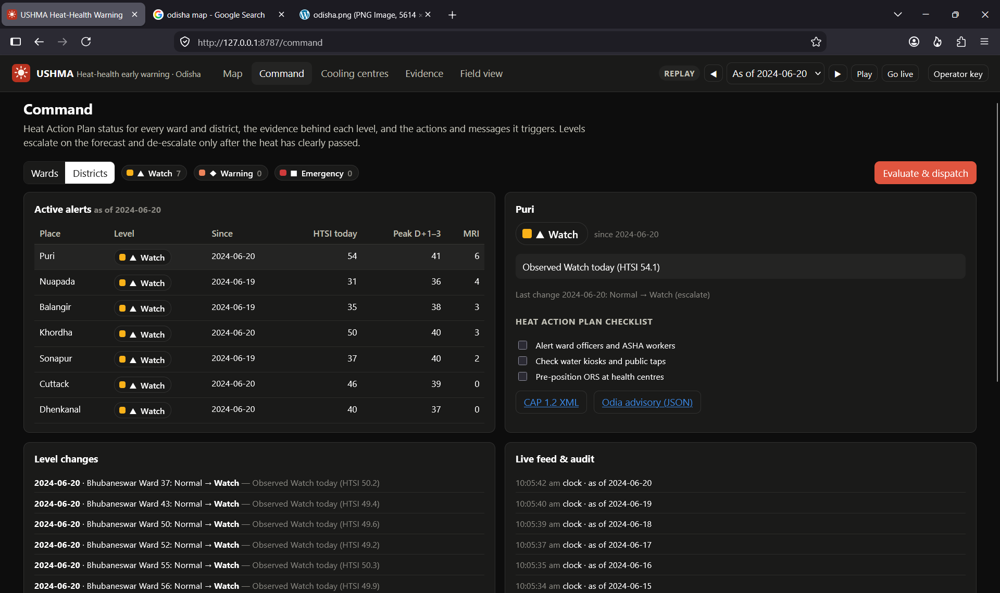
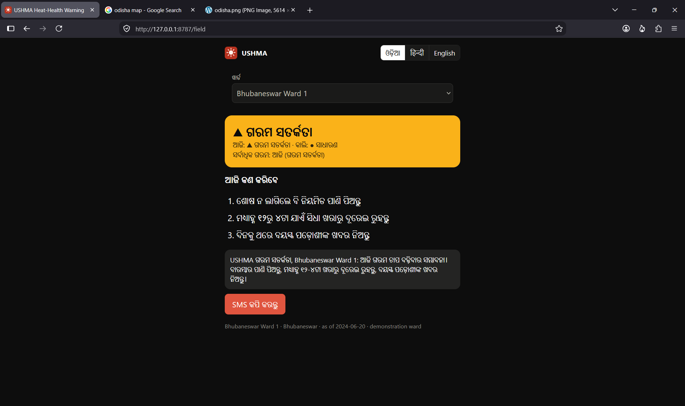

<div align="center">

# USHMA

**U**rban **S**ystem for **H**eat-stress **M**onitoring & **A**lerting

*Forecasting not what the weather will be, but what the weather will do.*

Impact-based heat-health early warning for Odisha: hourly heat physiology → ward-level mortality risk → Heat Action Plan triggers, CAP 1.2 alerts and Odia/Hindi/English advisories, 1–5 days ahead.

</div>

## Screenshots

Live dashboard (historical replay as of 2024-06-20):

### Map — ward heat bands



### Command — Heat Action Plan status



### Field view — ASHA advisory in Odia



---

## The problem

Indian heat warnings are issued on air temperature. But the body sheds heat by evaporating sweat, and whether that works depends on humidity, wind and sunshine together — through the day *and the night*. 40 °C at 20% humidity and 40 °C at 70% humidity are different events; the second can kill.

USHMA computes what the weather does to people, forecasts it, turns it into expected deaths per ward, and tells the people who can act what to do.

## What we found in the supplied dataMorphology:
Dicots: Kidney/bean-shaped guard cells arranged randomly.
Monocots: Dumbbell-shaped guard cells arranged in parallel rows.

We audited the inputs before building. Every finding shaped the design, and every one is documented rather than hidden.

| # | Finding | If ignored | What we did |
| --- | --- | --- | --- |
| 1 | The supplied notebook pairs **daily-max temperature with daily-mean humidity** — an hour that never happened | **49.7% of days "Red"**, WBGT up to 50 °C (unsurvivable) | Compute every index **hourly**, then aggregate |
| 2 | Mortality (2007–11) and weather (2015–25) **share no days** | Any "trained mortality model" is impossible or leaked | The ML model forecasts heat stress; deaths come from a transparent risk model with a transferred, labelled curve |
| 3 | **23,269 death records duplicated** across survey rounds in 14 districts | Mortality doubled in exactly those districts | De-duplicated on the decedent key |
| 4 | Four HVI columns are **identical for all 30 districts** | Vulnerability flat on half its inputs | Replaced with NFHS-5 district data parsed from `Odisha.pdf` |
| 5 | Weather timestamps are **local time with a 1-hour step at 82.9 °E**, not UTC | Every daily max and night window 5–6 h wrong | Measured per cell from solar phase; asserted in ingest |

## The result

942,112 in-state cell-days (2015–2025), against an IMD-style rule of daily max temperature ≥ 40 °C:

| | |
| --- | --- |
| USHMA alerts the temperature rule **misses** | **49.8%** — at mean air temperature 36.1 °C but mean **WBGT 36.4 °C**, above the survivability limit |
| **July–August** | temperature rule: **0 alerts** · USHMA: **977** |
| March–June days flagged | supplied notebook **49.7%** → USHMA Warning+ **3.0%** |
| Forecast error, D+1 (held-out 2024–25) | **3.51** HTSI pts vs persistence 4.45, climatology 4.91 |
| 80% uncertainty band coverage | **79%** after conformal calibration (raw 72%) |
| Warning-day detection, D+1 | AUC **0.93**, F1 0.26 vs persistence 0.18 |
| Heat-attributable deaths, 2024 | **1,933** (range 996–3,249), peaking in May — Odisha's worst year in the record |


## How it works

```
 5,279 hourly CSVs ─► hourly WBGT (Liljegren) · UTCI · Heat Index ─► daily max / night min / degree-hours
  (46 M rows)          tested against NOAA, UTCI, ISO 7726 references
        │
        ▼
 climatology (per cell, per day of year) ─► HTSI 0–100 ─► LightGBM D+1..D+5 + conformal bands + exceedance classifiers
                                             │                         (the only trained model)
                                             ▼
 AHS baseline (de-duplicated) × transferred risk curve × NFHS-5 vulnerability × ward population ─► excess deaths, MRI
                                             │
                                             ▼
 Heat Action Plan state machine ─► CAP 1.2 · SMS / WhatsApp / webhooks · advisories in 3 languages × 7 audiences
                                             │
                                             ▼
                 React + Leaflet dashboard  ·  ASHA field PWA  ·  cooling-centre optimiser
```

**Which part is AI.** One component: the LightGBM forecaster, trained on ~940,000 daily records for the 234 in-state grid cells, all derived from the mandated `nasapower_odisha` hourly data. Deaths are not a trainable label here (no overlapping years), so they are computed by a product of named terms — baseline × relative risk × vulnerability × population — every one inspectable on screen.

**Python** (`src/ushma/`) does the science and the model. **Node** (`server/`) serves the API, runs the alert engine and hosts the dashboard. They meet only at the JSON bundle in `data/serve/`.

## Quickstart

Prerequisites: Python 3.10+, Node.js 20+.

```bash
pip install -e ".[dev]"
```

```bash
python scripts/build_all.py
```

Builds everything (~3 h first time; each stage is skipped once its output exists).

```bash
cd server && npm install && npm start
```

```bash
cd dashboard && npm install && npm run build
```

Open **http://127.0.0.1:8787**. The demo opens on 29 May 2024, the peak of the 2024 heatwave; press **Play** to watch alerts escalate across the state day by day, or **Go live** to run today's forecast.

Tests:

```bash
python -m pytest tests -q
```

```bash
cd server && npm test
```

## What you can do with it

| Screen | For |
| --- | --- |
| **Map** | Heat band, mortality risk, excess deaths per 100k and vulnerability for 332 wards, 30 districts and 234 grid cells, D+0 to D+5; click a ward for its forecast with uncertainty, the reasons (SHAP, urban heat, risk arithmetic) and its advisory |
| **Command** | Alerts in force, why, since when; Heat Action Plan checklist; CAP XML; subscribers; dispatch and delivery log; live event stream |
| **Cooling centres** | "I can open N centres tomorrow — where?" Greedy max-cover over forecast deaths, with projected deaths averted |
| **Evidence** | The validation above, chart by chart, with table views |
| **Field view** | For ASHA workers: one ward, today's level, three actions, in Odia; works offline |

## Documentation

| | |
| --- | --- |
| [00 Problem and approach](docs/00_PROBLEM_AND_APPROACH.md) | requirement traceability |
| [01 Architecture](docs/01_ARCHITECTURE.md) | components, choices, security |
| [02 Data dictionary](docs/02_DATA_DICTIONARY.md) | every source, every defect |
| [03 Thermal indices](docs/03_THERMAL_INDICES.md) | WBGT, UTCI, HI — derivations and validation |
| [04 HTSI specification](docs/04_HTSI_SPEC.md) | the composite, its calibration and the evidence |
| [05 Mortality risk model](docs/05_MORTALITY_RISK_MODEL.md) | baseline, transferred curve, NCRB check |
| [06 Places and downscaling](docs/06_WARD_DOWNSCALING.md) | districts, cells, wards, urban heat island |
| [07 API reference](docs/07_API_REFERENCE.md) | every endpoint |
| [08 Dashboard](docs/08_DASHBOARD.md) | screens, colour, accessibility |
| [09 Alerting and HAP](docs/09_ALERTING_AND_HAP.md) | levels, hysteresis, advisories, CAP |
| [10 Model card](docs/10_MODEL_CARD.md) | the forecaster, honestly |
| [11 Validation report](docs/11_VALIDATION_REPORT.md) | generated from the artefacts |
| [12 Deployment](docs/12_DEPLOYMENT.md) | build, run, configure, cost |
| [13 Limitations and ethics](docs/13_LIMITATIONS_AND_ETHICS.md) | what it cannot know |
| [14 Demo script](docs/14_DEMO_SCRIPT.md) | the 5-minute walkthrough |
| [15 Roadmap](docs/15_ROADMAP.md) | from prototype to state deployment |

## Limitations, up front

The heat–mortality curve is transferred from the literature because the data cannot support fitting one. Ward boundaries are synthetic until real ones are supplied at `data/geo/wards.geojson`. The weather grid is ~27 km and wards are downscaled. Beyond two days, the history-only forecaster's edge over climatology is small; live mode uses numerical weather prediction instead. Odia and Hindi advisories await native-speaker review. The full list is in [13](docs/13_LIMITATIONS_AND_ETHICS.md).

<div align="center"><sub>Smart India Hackathon · Odisha heat-health early warning</sub></div>
