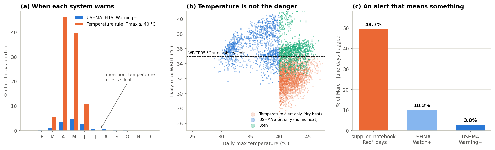

# Human Thermal Stress Index — Specification, Calibration and Evidence

> `src/ushma/indices/htsi.py`. Weights and band edges live in `src/ushma/config.py`, never in code.
> Every number below is reproduced by `scripts/build_all.py`; the evidence tables are regenerated in `11_VALIDATION_REPORT.md`.

## 1. Why a composite

The problem statement asks for *"a comprehensive Human Thermal Stress Index (integrating temperature, humidity, wind, and radiation)"*. WBGT alone is a snapshot of peak load; it says nothing about whether the night brought relief or how many days the spell has run. UTCI alone is absolute physiology and cannot tell that 42 °C is routine in Bolangir and alarming in Balasore. HTSI is a **0–100 composite of four physiologically distinct channels**, each separately inspectable on the dashboard.

## 2. Definition

$$\text{HTSI} = 0.50\,I + 0.20\,g\,A + 0.20\,N + 0.10\,g\,D$$

| Component | Weight | Input | Captures |
| --- | --- | --- | --- |
| **Intensity** $I$ | 0.50 | Daily-max UTCI on its published stress-band edges (9, 26, 32, 38, 46, 55 → 0, 25, 45, 65, 85, 100) | Peak physiological load |
| **Anomaly** $A$ | 0.20 | Day-of-year percentile of daily-max WBGT (flat below p80, steep through p90–p98) | How unusual this is *here* — acclimatisation |
| **Night relief** $N$ | 0.20 | Shortfall of overnight (22:00–06:00 IST) WBGT minimum below 26 °C; 6 °C = complete failure | Failure of overnight recovery |
| **Duration** $D$ | 0.10 | Consecutive days above local p90, concave, saturating near 5 days | Cumulative strain |
| **Gate** $g$ | — | $\text{clip}\big((\text{WBGT}_{\max}-27)/4,\,0,\,1\big)$ | Relative channels only count when it is physiologically hot |

## 3. Two corrections made during validation

Both were found by checking the index against the calendar, not by intuition.

**The gate.** Ungated, a sunny 28 °C January day with 13 °C nights — pleasant weather that is merely warm *for January* — scored ~81 on anomaly and ~39 on duration, crossed the Watch edge, and led the risk model to attribute ~860 heat deaths to December–January. A UTCI gate did not help: a person standing in midday sun reaches UTCI ~34 even in winter. WBGT separates them cleanly — 28.4 °C on those January days against 35.3 °C on May alert days. After gating, December–January carry under 2% of attributed deaths.

**The weights.** The first draft was 0.40 / 0.25 / 0.20 / 0.15. At those weights the relative channels (0.40 combined) outvoted absolute load: **19 October 2024 — 30.4 °C, UTCI 39, cool nights — outranked 30 May 2024 at 42.5 °C and UTCI 48**, because May is always hot and October rarely is. Four variants were compared:

| Variant | Top-1% days in Apr–Jun | in Jul–Sep | in Oct–Dec | 2024's top days |
| --- | --- | --- | --- | --- |
| First draft | 2.60% | 0.79% | 0.23% | 12 Oct, 10 Jun, 19 Oct |
| + hard UTCI gate | 3.63% | **0.05%** | 0.00% | Jun, May |
| **Intensity-led 0.50/0.20/0.20/0.10 (adopted)** | 3.24% | **0.39%** | 0.07% | **10 Jun, 31 May, 20 May, 30 May** |
| Both | 3.71% | 0.03% | 0.00% | Jun, May |

The hard gate was rejected because it **erases the monsoon humid-heat signal** — the very thing a temperature threshold cannot see. The adopted weights move the extremes into the pre-monsoon season, match the timing of Odisha's 2024 heatwave, and keep a monsoon signal.

## 4. Band calibration

A first draft set edges at (45, 65, 80) from intuition; the realised maximum HTSI across 1.9 million cell-days is 74.5, so Emergency could never have fired. Edges are now set from the March–June distribution over the 234 in-state cells:

| Band | Edge | Target share of summer days | Achieved |
| --- | --- | --- | --- |
| Watch | **48.5** | ~10% | 7.2% |
| Warning | **59.5** | ~3% | 2.0% |
| Emergency | **63.5** | ~1% | 1.05% |

**Independent cross-check** against a variable the calibration did not use: median HTSI is **60.4** on days with WBGT above 35 °C (the survivability limit) and **62.8** above 37 °C. Warning and Emergency sit where the physiology says they should.

## 5. The evidence: impact-based vs temperature-based

942,112 in-state cell-days, 2015–2025, against an IMD-style rule (daily max temperature ≥ 40 °C):

| | |
| --- | --- |
| USHMA Warning+ alerts the temperature rule **misses** | **49.8%** — mean Tmax 36.1 °C but mean WBGT **36.4 °C** |
| Temperature alerts USHMA does not escalate | 93.0% — mean WBGT 32.2 °C (dry heat; sweating still works) |
| **July–August, temperature-rule alerts** | **0** |
| July–August, USHMA Warning+ | **977** |
| March–June days flagged: supplied notebook "Red" | **49.7%** |
| March–June days flagged: USHMA Warning+ | **3.0%** |

In the monsoon, daily maximum temperature never reaches 40 °C anywhere in Odisha, so a temperature rule is silent for two months while WBGT sits above the survivability limit under near-saturated air. And in April, when the temperature rule fires on 46% of days, most of those are dry-heat days the body can still cope with.

## 6. Open items

1. **Weights are reasoned, not fitted** — no paired weather–mortality period exists to fit them against. A `fit_weights()` path belongs next to `dlnm.fit_local()`.
2. **A full weight-sensitivity sweep** (each weight ±50%) is still to be tabulated; the four-variant comparison above is the part done.
3. **The night threshold (26 °C WBGT) is a reasoned choice**, not a fitted one.
